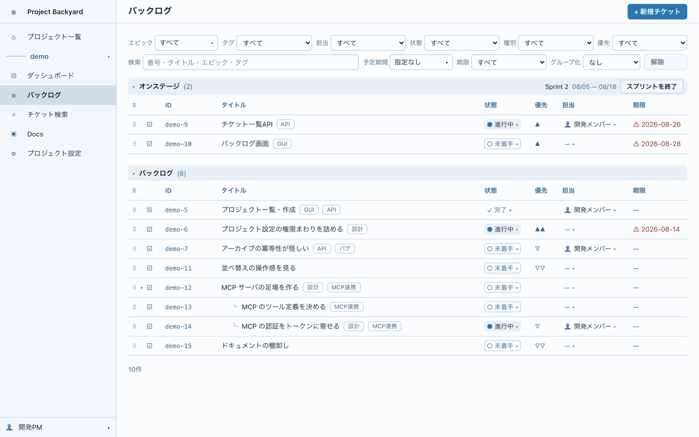

# Project Backyard

**Project Backyard（PB）** は、小規模なプロジェクトを管理するためのツールです。
人と AI エージェントが、同じチケットと同じ規約を見ながら1つのプロジェクトを進めることを目指しています。

- サーバ（Go）が画面も配信する**単一の実行ファイル**と、**PostgreSQL** だけで動きます
- 操作は Web ブラウザから行います。AI エージェントは **MCP** でサーバへ接続します
- 手元の PC（mac / Windows / Linux）でも、コンテナや Kubernetes の上でも動かせます



> [!WARNING]
> **開発中のソフトウェアです。** 機能も画面も変わっていきます。
> 大事なデータを置く前に、[バックアップと復元](#7-設定とメンテナンス)を確かめてください。

<!-- 英語版を用意したら README_EN.md を置き、ここにリンクを貼る -->

---

## 目次

1. [Project Backyard について](#1-project-backyard-について)
2. [提供機能](#2-提供機能)
3. [クイックスタート](#3-クイックスタート)
4. [サーバの構築と運用](#4-サーバの構築と運用)
5. [使い始める](#5-使い始める)
6. [AI エージェントを繋ぐ](#6-ai-エージェントを繋ぐ)
7. [設定とメンテナンス](#7-設定とメンテナンス)
8. [ライセンスと謝辞](#8-ライセンスと謝辞)
9. [設計と開発](#9-設計と開発)

---

## 1. Project Backyard について

### 解こうとしている課題

市販のプロジェクト管理ツールの多くは大規模な運用を前提にしており、少人数で使うには重く、構成も複雑です。
PB は、アジャイル・ウォーターフォールのどちらの進め方にも使える、軽いチケット管理ツールとして始まりました。

いまの PB は、もう一歩先の課題を扱っています。**複数の人が、それぞれ AI エージェントを伴って1つのプロジェクトを進める**と、
次のことが起きます。

| 起きること | 中身 |
|---|---|
| 学びが共有されない | 同じつまずきが各人の手元で1回ずつ起きる。誰から見ても「2回目」にならないので、規約に育たない |
| 判断が分かれる | 規約に無い場面で、各エージェントが別々の人に尋ね、別々の答えを得る |
| 決めた理由が消える | 「なぜこうなっているか」を知るのが決めた本人だけになる |
| 誰が何をしているか分からない | 同じ場所を2人が同時に触り、片方の作業が無駄になる |

一人で開発しているなら、`CLAUDE.md` のようなファイルをリポジトリに置くだけで足ります。
**PB が役に立つのは、参加者が複数になってからです。** PB は参加者の間に立ち、規約・判断の記録・チケットを1か所に集めます。

### 設計の原則

| 原則 | 意味 |
|---|---|
| **PB はエージェントを起動しない** | PB は情報とルールを渡す側に徹します。エージェントのほうから PB に接続してきます |
| **リポジトリには手順だけを置く** | チケットの本文・設計情報・履歴は、エージェントが作業するときに MCP で取りに来ます。配った内容が古くなることがありません |
| **AI は提案し、人が確定する** | エージェントの作業結果は、プロジェクトの知識として残す前に人が承認します |

### AI エージェントとの連携

- **チケットは「実行契約」です。** 前提・触ってよい範囲・完了条件（DoD）・成果物を、エージェントが読める形で持ちます
- **プロジェクト文書（憲章）** に、規約・価値観・判断の記録を置きます。どのエージェントも同じ文書を読みます
- **コンテキストパック**：チケットに着手するときに要る情報を、PB がまとめてエージェントへ渡します
- **完了レポート**：エージェントは、完了条件ごとの結果と作業で得た知見を PB へ返します
- Claude Code・Claude Desktop・Codex・GitHub Copilot（VS Code）への対応を目指しています。（[6章](#6-ai-エージェントを繋ぐ)）

### 軽く動かすための工夫

- **画面をサーバの実行ファイルに組み込んでいます。** 別の Web サーバを立てる必要はありません
- **外部のミドルウェアは PostgreSQL だけです。** 日本語の全文検索も、検索エンジンを持ち込まずに DB の中で行います（`pg_trgm`）
- **常時接続（WebSocket など）を持ちません。** 画面の更新は、間隔を置いた問い合わせで取ります

### 開発者より
本プロジェクトはプロジェクトマネジメントを行うツールとして、Web API・Webアプリケーションからなるシステムを開発しています。本システムは、個人から少人数で行う小規模プロジェクトをターゲットとして、個人のPC上でも軽量に動作することを目指しています。（開発者はM1 MacBook Pro上で、Rancher Desktopによる動作確認をしています）また、AI Agentの利用を積極的に行えるように、様々な機能を試行実装しています。
このアプリケーション自体がPBを使い、全てAI Agent（Claude CodeとCodex）によって実装されています。開発者が実際に書いたのはこの文章のみです。自己責任でご利用ください。

---

## 2. 提供機能

### 使える機能

| 分類 | 機能 |
|---|---|
| **プロジェクト** | プロジェクトの一覧・ダッシュボード・メンバーと役割 |
| **チケット** | バックログ（親子の階層・絞り込み）、チケットの詳細、検索、ステータスの遷移、タグ、完了条件（DoD） |
| **プロジェクト文書** | 規約・価値観・判断の記録などを Markdown で書き、全員とエージェントで共有する |
| **AI エージェント** | MCP サーバ、エージェントの登録と資格情報の発行、リポジトリへ置く設定ファイルの生成、コンテキストパック、完了レポート |
| **認証** | パスワード、多要素認証（認証アプリ）、パスキー、API トークン |
| **管理** | ユーザー管理、アプリケーション設定、TLS 証明書、DB のバックアップと復元 |
| **表示言語** | 日本語・英語（利用者ごとに切り替え） |

### 準備中の機能

画面の枠はありますが、中身はまだありません。

- カンバンボード、ガントチャート
- 承認キュー、プロジェクトメモリ、進捗分析、プロジェクトのヒストリー
- 監査ログ、システム管理

機能ごとの仕様は [docs/design/Requirements.md](docs/design/Requirements.md)（要件）と [docs/design/GuiDesign.md](docs/design/GuiDesign.md)（画面）にあります。

---

## 3. クイックスタート

手元の PC で試すなら、**compose で DB ごと立てる**のがいちばん手早い方法です。
[Docker](https://www.docker.com/)（または [Rancher Desktop](https://rancherdesktop.io/) などの互換環境）が要ります。

```sh
git clone <このリポジトリの URL>
cd ProjectBackyard

# 一式を作る。ARCH は端末の CPU に合わせる（Apple シリコンは arm64、Intel / AMD は amd64）
make release TARGET=compose ARCH=arm64

cd dist/pb-v*-compose-linux-arm64
docker load -i project-backyard-*.tar   # イメージを取り込む
./init.sh                               # DB のパスワードなどを乱数で作る（最初の1回だけ）
docker compose up -d                    # DB → スキーマ作成 → PB の順に起動する
docker compose run --rm app admin create   # 初期管理者を作る（最初の1回だけ）
```

**ブラウザで `http://localhost:8080` を開き**、作った管理者でログインします。
`127.0.0.1` ではなく `localhost` と書いてください（パスキーが `localhost` でしか使えないためです）。

止めるときは `docker compose stop`、データごと消すときは `docker compose down -v` です。

---

## 4. サーバの構築と運用

**手順の正本は [deploy/prod/MANUAL.md](deploy/prod/MANUAL.md)（配布物マニュアル）です。** 本章はその要約です。
マニュアルは `make release` が作る一式にも同梱されます。

### 動作環境

| もの | 条件 |
|---|---|
| CPU | 64bit の amd64 または arm64 |
| OS（native） | macOS / Linux / Windows。**Windows 向けの一式は、まだ実機で動かしていません** |
| コンテナ | Docker（compose を含む）、または Kubernetes |
| DB | **PostgreSQL 17**。拡張 `pgcrypto`・`citext`・`pg_trgm` と、**ICU** が使えること。公式イメージ `postgres:17` で動作を確かめています |
| 一式を作る端末 | native：Go と Node.js（[docs/Development.md](docs/Development.md) 1章）。コンテナ：Docker（buildx）だけ |

### 運用形態を選ぶ

**どの形でも、PB の配布物に DB は入っていません。** compose と Kubernetes のサンプルは、起動時に公開イメージの PostgreSQL を取りに行きます。

| 形 | 向いている使い方 | DB | マニュアル |
|---|---|---|---|
| **native** | PC に直接入れて、常駐させる | 用意済みの PostgreSQL に繋ぐ | [3章](deploy/prod/MANUAL.md#3-nativemac--windows--linux) |
| **docker** | コンテナで動かし、DB は別に持つ | 用意済みの PostgreSQL に繋ぐ | [4.6](deploy/prod/MANUAL.md#46-docker-単体で動かす) |
| **compose** | DB ごとまとめて立てる。**まず試すならこれ** | DB のコンテナも立てる（外部の DB にも繋げる） | [4.4](deploy/prod/MANUAL.md#44-compose-で動かす) |
| **Kubernetes** | クラスタで動かす | 試すための DB のサンプル付き。運用では CloudNativePG か外部の DB | [5章](deploy/prod/MANUAL.md#5-kubernetes) |

### 一式を作る

リポジトリの直下で `make release` を実行すると、選んだ形の一式が `dist/` に出力されます。

```sh
make release TARGET=native OS=<darwin|windows|linux> ARCH=<amd64|arm64>
make release TARGET=<docker|compose|k8s> ARCH=<amd64|arm64> [PUSH=<レジストリ>/<名前>:<タグ>]
```

`PUSH` を付けると、イメージを tar に出す代わりにレジストリへ送ります。

### 初回の流れ

| 形 | 流れ |
|---|---|
| native | DB とロールを作る → 秘密ファイルを置く → `./migrate.sh` → `./run.sh admin create` → `./run.sh` |
| compose | `docker load` → `./init.sh` → `docker compose up -d` → `docker compose run --rm app admin create` |
| Kubernetes | イメージを届ける → Secret を作る → `kubectl apply` → `/pb admin create` → `kubectl port-forward` |

native を常駐させる雛形（launchd / systemd / タスクスケジューラ）も一式に入っています。

### 新しい版へ入れ替える

**入れ替える前に、必ずバックアップを取ってください。** スキーマは前へ進めるだけで、戻す手順はありません。
新しい一式を作り、設定と秘密を引き継いでから、スキーマを進めて起動します。
形ごとの手順は、マニュアルの 3.11（native）・4.7（コンテナ）・5.9（Kubernetes）にあります。

### 端末の外へ公開する

**既定では、その端末からしか開けません。平文（http）のまま外へ出さないでください。**
画面から証明書を登録して TLS を有効にしてから、待受アドレスを変えます（マニュアル 3.10）。

---

## 5. 使い始める

1. **管理者でログインし、利用者を作ります。**「管理 → アカウント / 権限」から作成します
2. **プロジェクトを作り、メンバーを加えます。** メンバーの追加と役割の割り当ては、同じく「アカウント / 権限」で利用者ごとに行います
3. **各利用者は「自分の設定」を整えます。** パスワードの変更、多要素認証やパスキーの登録、表示言語の切り替えができます
4. **チケットを起票し、プロジェクト文書に規約を書きます。** エージェントを使うなら、続けて[6章](#6-ai-エージェントを繋ぐ)へ進みます

<!-- 利用者向けマニュアル（画面ごとの操作）を用意したら、ここにリンクを貼る -->

---

## 6. AI エージェントを繋ぐ

エージェントは MCP で PB に接続し、チケットや文書を読み書きします。
接続先は `http(s)://<PB のアドレス>/mcp/<プロジェクトキー>` です。

### 対応を目指しているクライアント

設定ファイルと手順は4種類とも用意していますが、実際に動かして確かめたのは一部です。

| クライアント | 動作確認 | 参画するとき | チケットに着手するとき |
|---|---|---|---|
| Claude Code | 確認済み | `/pb-onboard` | `/pb-implement <番号>` |
| Codex | 確認済み | 「PB に参画して」と伝える | 「PB のチケット <番号> を実装して」と伝える |
| Claude Desktop | 未確認 | 「PB に参画して」と伝える | 「PB のチケット <番号> を実装して」と伝える |
| GitHub Copilot（VS Code） | 未確認 | `pb-onboard` プロンプト | `pb-implement` プロンプト |

### 準備（リポジトリにつき1回）

プロジェクトの管理者が行います。

1. プロジェクト設定に、リポジトリの URL を登録します
2. 「エージェント連携セットアップ」画面（`/p/<キー>/settings/agents`）で使うクライアントを選び、設定ファイル一式をダウンロードします
3. リポジトリの直下に展開してコミットします。既存の `CLAUDE.md` や `AGENTS.md` があれば、PB の区画だけが追記されます

### 参画（参加者ごとに1回）

1. 「自分の設定 → エージェント」（`/me/agents`）で自分のエージェントを登録し、トークンを発行します。**トークンは発行したときに一度だけ表示されます**
2. 同じ画面から接続設定（`.mcp.json` など）を受け取り、作業フォルダに置きます。**このファイルはコミットしません**
3. 画面に出る `export` 行をシェルの設定に加え、トークンを入れます（Copilot は VS Code が初回に尋ねるので不要です）
4. エージェントを起動して参画の手順を実行します。PB の画面に「接続済み」の印が付きます

**エージェントは、登録した人の権限の範囲で動きます。**
仕組みの詳細は [docs/design/Requirements.md](docs/design/Requirements.md) 10章と [docs/design/Design.md](docs/design/Design.md) 8章にあります。

<!-- エージェントのセットアップ手順書を独立させたら、ここにリンクを貼る -->

---

## 7. 設定とメンテナンス

**設定は、画面の「管理 → アプリケーション設定」から変えるのが基本です。** 反映が即時か、再起動が要るかは画面に表示されます。

| タブ | 扱うもの |
|---|---|
| 一般 | 待受アドレス、Cookie の Secure 属性など |
| TLS 証明書 | 証明書の登録と TLS の有効化。**有効にしたあと、期限内に確認しないと元に戻ります** |
| DB | 接続状態の確認、**バックアップのダウンロードと復元** |

- **画面から変えられないように固定したい設定は、設定ファイル `pb.yaml` に書きます。** 画面には「固定」と表示されます
- 待受（アドレスとポート）は、起動スクリプトや環境変数で決まっていることがあります。そのときは画面に「環境変数で固定」と表示されます
- **認証アプリを失くした管理者は**、サーバ側のコマンドで第2要素を外せます（[docs/design/Design.md](docs/design/Design.md) 6.7.5）

設定の仕組みは [docs/design/Design.md](docs/design/Design.md) 10.3、バックアップの仕様は [docs/design/DbDesign.md](docs/design/DbDesign.md) 9.1 にあります。

---

## 8. ライセンスと謝辞

### ライセンス

PB は **Apache License 2.0** で公開しています。全文は [LICENSE](LICENSE) にあります。

### 利用しているソフトウェア

PB は、次のオープンソースソフトウェアの上に成り立っています。作者の皆さんに感謝します。
下の表は直接依存しているものだけです。各ライセンスの全文は、それぞれの配布元にあります。
<!-- 間接依存を含む第三者ライセンスの文書は pb-162 で生成する。できたらここからリンクする -->

**サーバ（Go）**

| ソフトウェア | 用途 | ライセンス |
|---|---|---|
| [chi](https://github.com/go-chi/chi) | HTTP ルータ | MIT |
| [pgx](https://github.com/jackc/pgx) | PostgreSQL ドライバ | MIT |
| [goose](https://github.com/pressly/goose) | スキーマのマイグレーション | MIT |
| [go-webauthn](https://github.com/go-webauthn/webauthn) | パスキー | BSD-3-Clause |
| [argon2id](https://github.com/alexedwards/argon2id) | パスワードのハッシュ | MIT |
| [ulid](https://github.com/oklog/ulid) | ID の生成 | Apache-2.0 |
| [yaml.v3](https://github.com/go-yaml/yaml) | 設定ファイルの読み込み | MIT / Apache-2.0 |
| [x/term](https://pkg.go.dev/golang.org/x/term) | 端末からのパスワード入力 | BSD-3-Clause |

**画面（Vue）**

| ソフトウェア | 用途 | ライセンス |
|---|---|---|
| [Vue](https://vuejs.org/)・[Vue Router](https://router.vuejs.org/)・[Pinia](https://pinia.vuejs.org/) | 画面の土台・画面遷移・状態管理 | MIT |
| [Vue I18n](https://vue-i18n.intlify.dev/) | 多言語対応 | MIT |
| [CodeMirror](https://codemirror.net/) | Markdown エディタ | MIT |
| [markdown-it](https://github.com/markdown-it/markdown-it) | Markdown の表示 | MIT |
| [DOMPurify](https://github.com/cure53/DOMPurify) | 表示する HTML の無害化 | MPL-2.0 または Apache-2.0 |
| [node-qrcode](https://github.com/soldair/node-qrcode) | 多要素認証の QR コード | MIT |

**実行環境**：[PostgreSQL](https://www.postgresql.org/)（PostgreSQL License）。compose と Kubernetes のサンプルは、公開イメージ `pgvector/pgvector:pg17` を使います。

---

## 9. 設計と開発

**PB は、ある程度の完成形に至るまで、作者が一人で開発を進めています。** 現時点では、開発への参加（プルリクエストなど）は募集していません。

設計文書は [docs/](docs/) にあります。索引は [docs/README.md](docs/README.md) です。

| 文書 | 中身 |
|---|---|
| [Requirements.md](docs/design/Requirements.md) | 要件と構想。何を・なぜ作るか |
| [Design.md](docs/design/Design.md) | 全体設計。技術選定・認証と認可・MCP |
| [DbDesign.md](docs/design/DbDesign.md) | DB のスキーマとマイグレーション |
| [ApiDesign.md](docs/design/ApiDesign.md)・[openapi.yaml](docs/design/openapi.yaml) | REST API |
| [GuiDesign.md](docs/design/GuiDesign.md) | 画面・画面遷移・配色 |
| [Development.md](docs/Development.md) | ソースから動かす手順 |
| [Testing.md](docs/Testing.md) | 試験の設計 |

### 技術スタック

| 用途 | 採用 |
|---|---|
| サーバ | Go 1.26+、chi v5、pgx v5、sqlc、goose v3 |
| DB | PostgreSQL 17 |
| 画面 | Vue 3、TypeScript、Vite、Pinia |

### ソースから動かす

```sh
make up        # DB を起動する（docker compose）
make migrate   # スキーマを作る
make run       # サーバを起動する（http://localhost:8080）
make test
```

秘密ファイルの置き方やデモデータの入れ方など、最初の準備は [docs/Development.md](docs/Development.md) 2章にあります。

PB 自身の開発も PB で管理しており、実装は AI エージェント（Claude Code と Codex）が行っています。
[CLAUDE.md](CLAUDE.md) と [AGENTS.md](AGENTS.md) は、そのエージェントが読む取扱説明です。
